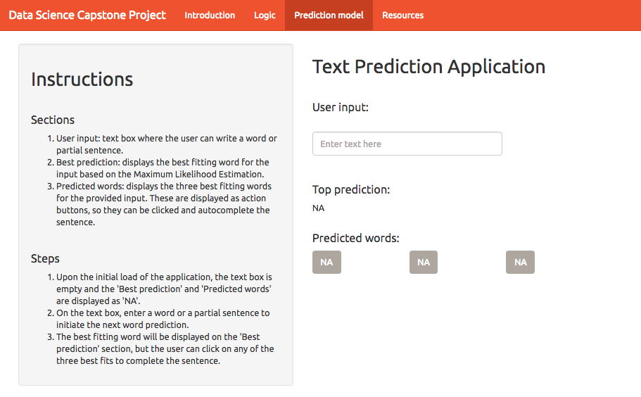

# Data Science Capstone Project

Data Science Coursera Specialization is offered by Johns Hopkins University. This specialization covers the concepts and tools that will be need throughout the entire data science pipeline, from asking the right kinds of questions to making inferences and publishing results [1].

As part of the final Capstone Project, a data product will be developed using real-world data. In this case the goal is the development of a text prediction algorithm in collaboration with SwiftKey.

## Getting and cleaning the data
The data used in this project is provided by SwiftKey via Coursera. Text files are written in English, German, Russian, and Finnish, but for the purpose of this excercise only the English database will be used. The text inputs come from different mediums such as blogs, news, and Twitter posts. In order to build the text predictive model and not to run out of processing resources, a 5% sample has been taken.

The sample dataset was then cleaned, by transforming all characters to lowercase, stemming words, and removing numbers, punctuation marks, bad words, contractions, left out letters and extra white spaces.

## Text prediction algorithm
For the text prediction algorithm, the Markov Property was applied to build the n-grams. This property assumes that there is a sequence of random variables, and the value of each variable depends on the previous elements in the sequence. So, in most of the cases, the value of the present variable is sufficient to predict the next random variable [2].

After building the n-grams, the Maximum Likelihood Estimation was applied. The Maximum Likelihood Estimation is a method that determines values for the parameters of a model. The parameter values are found such that they maximise the likelihood that the process described by the model produced the data that were actually observed [3]. When applied this method, the best prediction can be calculated from the user's input.

For this project, we are asked to make a single word prediction, which I have defined as the 'best prediction'. Nevertheless, I will be presenting the top 3 predictions, in order to increase accuracy and improve user experience.

## Text Prediction Application

## Slide Deck
Please find the slide deck for this application in <a herf ="http://rpubs.com/isisibarra/textPredictiveApp"> here</a>. 

## Resources
[1] “Data Science.” Coursera, John Hopkins University, www.coursera.org/specializations/jhu-data-science.  
[2] Robin. “Natural Language Processing.” Markov Models, 2009, language.worldofcomputing. net/pos-tagging/markov-models.html.  
[3] Brooks-Bartlett, Jonny. “Probability Concepts Explained: Maximum Likelihood Estimation.” Probability Concepts Explained: Maximum Likelihood Estimation, Towards Data Science, 3 Jan. 2018, towardsdatascience.com/probability-concepts-explained-maximum-likelihood-estimation- c7b4342fdbb1.
